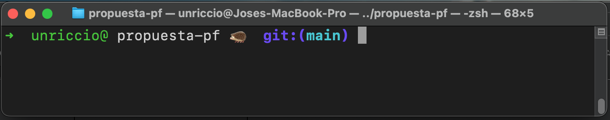

<p align="center">
  <strong style="font-size: 28px;">👋 Aqui comenzamos a praticar el flow de GitHub </strong>
</p>
<p align="center">
  <strong style="font-size: 32px;">Por ahora modifiquemos directametne el archivo y hagan el "push" </strong>
</p>
<br>

## Links importantes
[Jira](https://pablo-besler.atlassian.net/jira/core/projects/PFH/list?filter=updatedDate%20%3E%3D%20-1w&hideDone=false)


## Como contribuir con el proyecto:
1. **Actualiza tu fork en tu repositorio GitHub. (hay un boton para eso en tu repo en GitHub)**

2. **Actualiza tu rama main en tu maquina:**
```bash
git pull origin main (trae los cambios del repo remoto al repo local)
```

3. **Se crea una nueva rama:**
```bash
git checkout -b nombre-de-la-rama
```

- Aqui cuando se crea la rama, inmediatamente ya te saltas a la nueva rama, dejando asi la rama main.
- Si tenes dudas y quiere saber en que rama estas use:
```bash
git branch
```
- Tambien es recomendable configurar el PROMPT de la consola para ver en que rama estamos:
  



- Para saltar de una rama a otra:
```bash
git checkout nombre_de_alguna_rama
```

4. **Escriba tu codigo en la rama nueva que recien creaste.**

5. **Una vez que termine de escribir, haga lo que ya sabemos:**
```bash
git add .
git commit -m "bla bla bla"
```

6. **Haga el push de la rama nueva:**
```bash
git push origin nombre-de-la-rama
```

- UNA VEZ QUE TU CONTRIBUICION FUE ACEPTADA (Puede tardar horas, dias, semanas):

7. **Actualiza tu fork en tu repositorio. (hay un boton para eso en tu repo en github)**

8. **En tu maquina, vuelva a la rama main:**
```bash
git checkout main
```

9. **Elimine la rama nueva para evitar problemas:**
```bash
git branch -d nombre-de-la-rama
```
- Solo debe permanecer la rama main.

- Para contribuir otra vez, siga todos los pasos anteriores.

## Comandos utiles:

- En que rama estoy?
```bash
git branch
```

- Intercambiar de ramas:
```bash
git checkout nombre_de_alguna_rama
```

- Para crear una rama:
```bash
git checkout -b nombre_de_alguna_rama
```

- Para eliminar una rama:
```bash
git branch -d nombre_de_alguna_rama
```

- Para actualizar mi repo local con todo lo nuevo que tiene el repo remoto(GitHub)
```bash
git pull origin main
```

<div align="center">  


</div>


  [](https://www.buymeacoffee.com/pablobesler)
